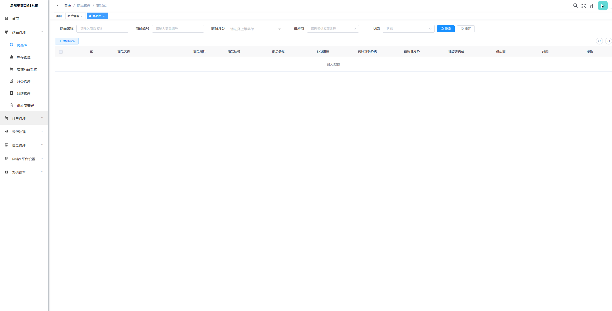
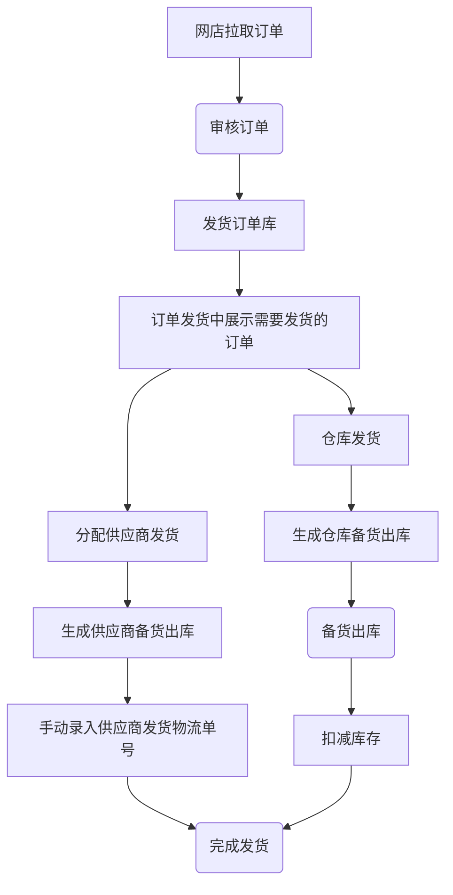
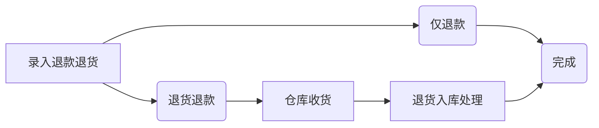
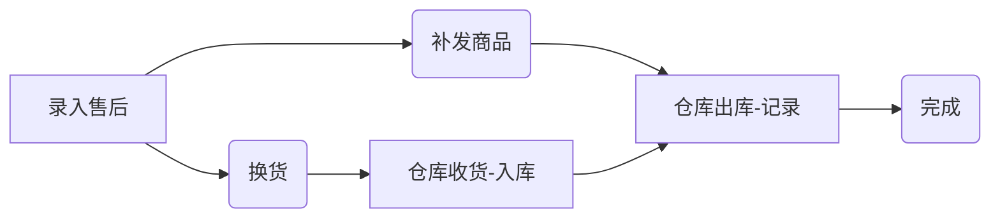
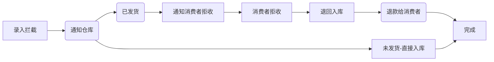

# 启航电商OMS系统3.0版
> **欢迎来到我们的开源项目！创新、协作、高质量的代码。您的Star🌟，是我们前进的动力！ 💪✨🏆**

> **项目持续更新中，还有很多不足，请多包含！如有任何疑问请提交issue！谢谢！ 💪✨🏆**

## 🎉 3.0版本重大升级

启航OMS 3.0版本全新发布！带来了多项重大升级，为您的电商订单管理提供更强大的支持。

### 🌟 核心升级亮点

| 升级项 | 说明 |
|--------|------|
| **多商户架构** | 支持多租户数据隔离，店铺归属商户管理 |
| **自动任务系统** | 订单自动拉取，无需手动操作 |
| **统一数据结构** | 采用商业版数据结构，底层架构升级 |
| **前端Vue2升级** | 底层框架升级，UI界面看齐商业版 |
| **AI智能分析** | 销售分析、库存优化、客户洞察等AI功能 |
| **多平台扩展** | 新增快手、小红书平台支持 |

### 📖 详细升级文档

- **升级报告**：[OMS3.0升级报告](OMS3.0_UPGRADE_REPORT.md) - 面向用户的升级亮点介绍
- **技术文档**：[OMS3.0架构文档](OMS3.0_ARCHITECTURE.md) - 面向开发者的技术实现说明

---

## 一、系统介绍

启航电商OMS系统是一个完整开箱即用的开源电商OMS系统，经历多个版本的迭代优化和客户使用验证。开发者可以直接部署即可使用。

启航电商OMS系统专注核心订单处理业务，主体功能包括：商品管理、店铺商品管理、订单库、店铺订单管理、发货管理（支持仓库发货、供应商发货）、售后管理、库存管理等。

与此同时该系统会陆续增加供外部调用的API，以便开发者满足自己的个性化业务需求。

启航电商ERP系统支持：淘宝天猫、京东、拼多多、抖店、微信小店、快手、小红书等平台，后续将继续对接其他电商平台。



## 二、主体功能

主体功能包括：
+ 商品管理：商品库管理、店铺商品管理（拉取店铺商品、ERP关联）。
+ 订单管理：店铺订单同步、管理、自动拉取。
+ 发货管理：电子面单打印、发货记录、物流跟踪等。
+ 售后管理：店铺售后同步、售后处理（补发、换货、退货处理）等。
+ 店铺&平台参数设置：店铺管理、商户管理、平台参数设置。

**基本上覆盖了电商网店管理日常业务，可使用接口对接内部ERP系统。**

**订单打单（电子面单打印）已支持：淘宝、京东、拼多多、抖店、微信小店**

## 三、功能模块

#### 1、商品管理
+ 商品库：管理商品库商品，提供手动录入、API接收功能，可以设置自己发货还是供应商发货（影响到后台分单逻辑，即时生效）。
  + 商品Sku：查看所有商品库SKU
+ 库存管理：支持手动修改库存（备货出库之后会扣减库存）
+ 店铺商品：店铺商品管理，店铺商品API拉取、店铺商品API更新（进行店铺商品与商品库商品关联，根据SKU编码关联）。
+ 分类管理：分类及分类属性管理（规格属性是用来组合Sku的）
+ 品牌管理
+ 供应商管理

#### 2、订单管理
+ 发货订单库：需要发货的订单查询，发货订单明细查询。
+ 店铺订单管理：订单API拉取、订单API更新、订单确认（确认之后订单进入发货订单库）等，支持淘宝天猫、京东、拼多多、抖店、微信小店、快手、小红书。
+ 订单拉取日志：记录店铺订单每次拉取日志。
+ 折扣管理：折扣活动配置

#### 3、发货管理
+ 订单发货：处理待发货的订单，支持手动发货、分配给供应商发货。
  + 手动发货：手动填写物流单号进行发货，手动发货之后将进入备货出库中。
  + 供应商发货：分配给供应商发货，分配之后将进入备货出库中；
  + 云仓发货：推送订单至云仓发货（钩子功能）

+ 电子面单发货：支持快递打印、发货、补单等功能。
+ 备货出库：已发货、已分配给供应商发货、电子面单打印快递单完成都会加入备货清单，提供给仓库备货查询。备货单可以生成出库单。
  + 供应商备货支持手动填写物流单号，实现发货。
  + 仓库备货出库：备货出库之后将扣减库存。
+ 发货记录：发货记录，提供手动发货功能。
+ 发货设置：设置发货快递、电子面单账户等信息
  + 快递公司管理：管理发货的快递公司（支持从平台拉取、支持手动添加）。
  + 电子面单账户设置：管理店铺开通的电子面单账户

#### 4、售后管理
+ 售后中心：聚合售后查询、详情、管理。
+ 店铺售后管理：售后API拉取、售后API更新、手动推送、售后操作（同意、备注）。
+ 售后处理记录：售后处理的记录查询，提供手动售后处理功能。
+ 售后台账：售后统计台账

#### 5、店铺&平台设置
+ 店铺管理
+ 商户管理（多租户）
+ 平台开关
+ 接口授权
+ 定时任务配置
+ 平台拉取日志
+ 快递公司库

#### 6、系统设置
+ 用户管理
+ 菜单管理
+ 角色管理
+ 部门管理
+ 字典管理

## 四、技术文档

> 👉 **详细技术文档请参考：[OMS3.0架构文档](OMS3.0_ARCHITECTURE.md)**

技术文档包含：
- 技术架构设计
- 核心功能实现
- 业务流程图
- API接口规范
- 代码规范
- 扩展建议

## 五、主要流程

### 1 发货流程

**订单发货流程**


### 2 售后处理流程

**退货退款流程**


**售后流程**


**订单拦截**


## 六、部署说明

#### 0 版本说明
+ Java：17
+ Nodejs：v16
+ SpringBoot:3
+ MySQL:8
+ Redis:7

#### 1 配置MySQL

+ 创建数据库`qihang-oms`
+ 导入数据库结构：sql脚本`docs\qihang-oms.sql`

#### 2 启动Redis

#### 3 修改项目配置

+ 修改`api`项目中的配置文件`application.yml`配置`Mysql`相关配置。

#### 4 mvn打包部署
+ Java版本：`Java 17`
+ Maven版本：`3.8`
  `mvn clean package`

#### 5 前端 `vue`打包
+ nodejs版本要求：`v16.x`
+ 安装依赖：`npm install --registry=https://registry.npmmirror.com`
+ 打包`npm run build:prod`

#### 6 修改Nginx配置

```
# 前端web配置
location / {
        root /usr/share/nginx/html;
        index  index.html index.htm;
        try_files $uri $uri/ /index.html;
    }

location /prod-api/ {
    proxy_set_header Host $http_host;
    proxy_set_header X-Real-IP $remote_addr;
    proxy_set_header REMOTE-HOST $remote_addr;
    proxy_set_header X-Forwarded-For $proxy_add_x_forwarded_for;
    proxy_pass http://localhost:8086/;
}
```

#### 7 访问web
+ 访问地址：`http://localhost`
+ 登录名：`admin`
+ 登录密码：`Andy@2025`

---

##### 💡 如果不想自己折腾？

* **没有技术团队？** 启航电商ERP商业版提供一键部署 + 7x24小时技术支持
* **申请不到 AppKey？** 商业版除了支持电商开放平台AppKey之外还集成了第三方API接口（使用第三方API无需自行申请Appkey）
* **需要更多功能？** 商业版支持多商户、多仓库、AI智能分析

👉 **[启航电商ERP商业版](https://qihangerp.cn)** |

---

## 📦 启航电商开源生态

启航电商旗下开源项目矩阵，所有项目共同指向统一商业版：

| 项目                                                       | 定位                            | Gitee | GitHub |
|:-----------------------------------------------------------|:------------------------------|:-----|:-------|
| [启航电商ERP]                                              | 电商业务AI底座（微服务）                 | [Gitee](https://gitee.com/qiliping/qihang-ecom-erp-open) | [GitHub](https://github.com/zeasin/qihang-ecom-erp-open) |
| **OMS 订单中台 ⬅**                                        | **轻量级订单管理**                   | [Gitee](https://gitee.com/qiliping/qihang-oms) | [GitHub](https://github.com/zeasin/qihang-ecom-oms) |
| [跨境云仓WMS] | 专为跨境云仓服务商打造 > 智能仓配，高效管理，一键无忧。 | [Gitee](https://gitee.com/qiliping/qihang-cloud-wms) | [GitHub](https://github.com/zeasin/qihang-cloud-wms) |

## 💼 商业版

👉 **[启航电商ERP官网](https://qihangerp.cn)**


## 📱 关注我们

|                   公众号：启航电商ERP                   |                   个人号：码农老齐                   |
|:-----------------------------------------------:|:--------------------------------------------:|
|                 产品动态·行业方案·客户案例                  |                技术实战·开源故事·创业心得                |
|  |  |

**感谢关注！我希望将从事电商 10 余年的行业经验沉淀在代码中，帮助大家真正提升经营效率。**

💖 如果项目对您有帮助，请点个 **Star ⭐** 给予鼓励！

---
